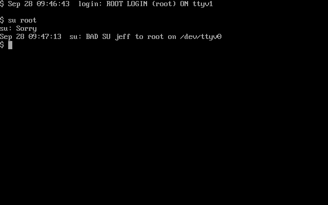
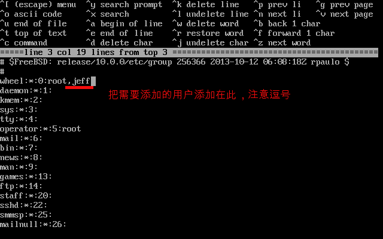
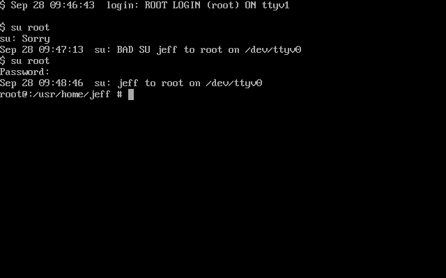

刚刚从Ubuntu转到FreeBSD，各种操作的不习惯，其中遇到的第一个是FreeBSD下居然不能用su来从普通用户切换到root用户下。

当然不是FreeBSD不支持此操作了，而是BSD更严谨的不是默认支持此操作。所以需要小小的设置一下。

只需要在把需要切换的账户（这里是jeff）添加到root得组下即可。

现在支持从普通用户通过su向超级用户切换了

这样的设置可以有选择的准许某些用户可以执行root操作，而其他的则不可以，拥有更多地权限控制。